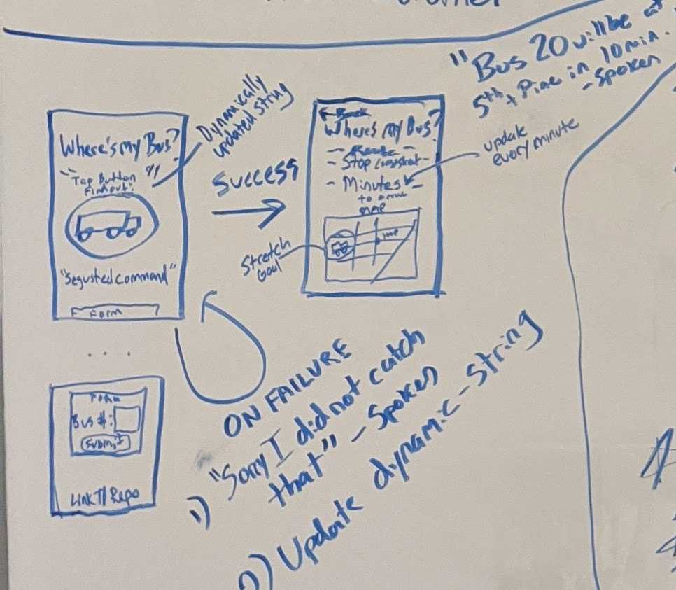

# Where's My Bus?
Django/React-Native application that allows users to query estimated arrival time for busses in their area.
This app is designed for someone that already knows details about his commute by knowing his bus number but doesn't necessarily wants to always keep track of the time.

## Contributors:
  * Stephen Koch kochsjs@gmail.com
  * Anastasia Lebedeva nastinsk@gmail.com
  * Leandro Rodriguez lrodriguezjb@gmail.com
  * Charles Glass charlie-glass@live.com
  * Alvian Joseph alvianjoseph@gmail.com

## MVP
A mobile-based application that allows an experienced commuter (user) to quickly check on the status of their bus by typing the bus number in the form. The app should then quickly return in how many minutes the bus will be at the bus stop and display near by bus stops for the bus on te map .

MVP will be presenting the app on a mobile device

## Stretch Goals
* check on the status of their bus by asking "When does X bus come to X location?" the app should then quickly respond by telling the commuter (user) in how many minutes the bus will be at the bus stop.
* Find bus time not only by current user location but with other locations
* Save your routes in database with login
* Keep all neray routse in state
* Suggestions for routes
* Function to set alarm when the particular bus nearby

## User Stories
1. As a user, I want to an updated time of when my bus is going to arrive.

2. As a user I want to get a descriptive error message in case if data about my bus is not available.

3. As a user I want to voice activate the app and ask for what time my specific bus will pass

4. As a Developer, I want to be able to send a get request to the API and get data back

5. As a User, I want to be asked if the app has my permission to use my location/microphone

## Team Agreement

Communication plan

* Communicate in Slack from 8am to 6pm
* Communicate in person
* Meet in class @ 9am
* Phone numbers for emergency
* Honest group stand up before official stand up with TAs:
  - Do daily TODO's on the whiteboard
  - check MVP progress
  - check stretch goals
* Everyone heard, Don't alk over other team members, vote
* Psychological safety: if see/feel something - say something. Go to TAs or JB in case if conflict can be solved inside of the group

Conflict Plan

* Don’t let conflict continue past 7.5 minutes - if 7.5 minutes+, request third party intervention
* Put a subject of conflict to a vote

Work Plan

* Work time 9am to 6pm.
* Lunch window is from 12:00 PM - 2:00 PM.
* Breaks as needed, be adult.
* No obligation on the weekend
* Daily TODO's tasks will be on the whiteboard
* Don't spend more than 15 minutes if stuck on something
  - check in with each other
* Charlie will update Trello every day with the tasks from whiteboard
* Project management tools:
  - Whiteboard
  - Trello

Git Process

### Our branches:
* Master
* Dev branch
* Feature branches
    - personal brunches
    - person_name_feature
* Organization on Github
* Push to dev branch working feature:
  - Create pull request to dev
  - Communicate it
  - 1 team member should review it
* Descriptive commit messages
* Only working code on master branch
* Pull request to master should be approved by 2 team members

## Project Management tools:

#### [Trello Board](https://trello.com/b/xzsr3H5I/wheres-my-bus)

#### Wireframe

